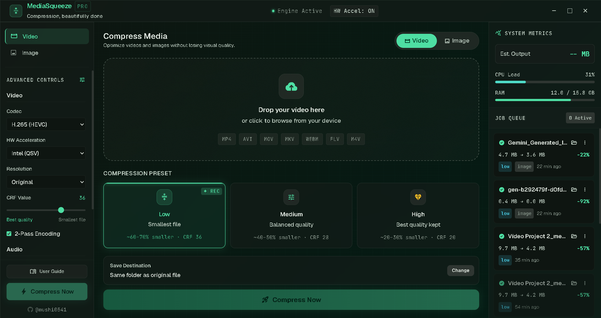

<h1 align="center">MediaSqueeze Website 🌐</h1>

<p align="center">
  <strong>The official marketing landing page for MediaSqueeze.</strong>
</p>

<p align="center">
  
  
  
</p>

<p align="center">
  
</p>

---

## ✨ Overview

This repository houses the front-end landing page for **[MediaSqueeze](https://github.com/mushi0541/MediaSqueeze)**, a blazing-fast, commercial-grade desktop media compression application.

The website is designed with a premium, hardware-accelerated aesthetic, featuring:
* Responsive Mobile & Desktop Layouts
* Glassmorphism & Parallax UI elements
* Direct links to GitHub binary releases

---

## 🛠️ Local Development

To run this website locally, you do not need any complex build steps or package managers.

1. **Clone the repository:**
   ```bash
   git clone https://github.com/mushi0541/MediaSqueeze-Website.git
   cd MediaSqueeze-Website
   ```

2. **Run locally:**
   Simply double-click the `index.html` file to open it in your browser, or use a tool like [Live Server](https://marketplace.visualstudio.com/items?itemName=ritwickdey.LiveServer) in VS Code for hot-reloading.

---

## 🚀 Deployment

This static HTML website is completely optimized for **1-Click Vercel Deployment**.

1. Create an account on [Vercel](https://vercel.com).
2. Click **Add New Project**.
3. Import this GitHub repository.
4. Click **Deploy**. Vercel will instantly build and host the site!

---

## 🔗 Links

* **Main Application Repository:** [MediaSqueeze App](https://github.com/mushi0541/MediaSqueeze)
* **Report a Bug:** [Issues Page](https://github.com/mushi0541/MediaSqueeze-Website/issues)

Developed with ❤️ by **Mushahid** ([@mushi0541](https://github.com/mushi0541))
